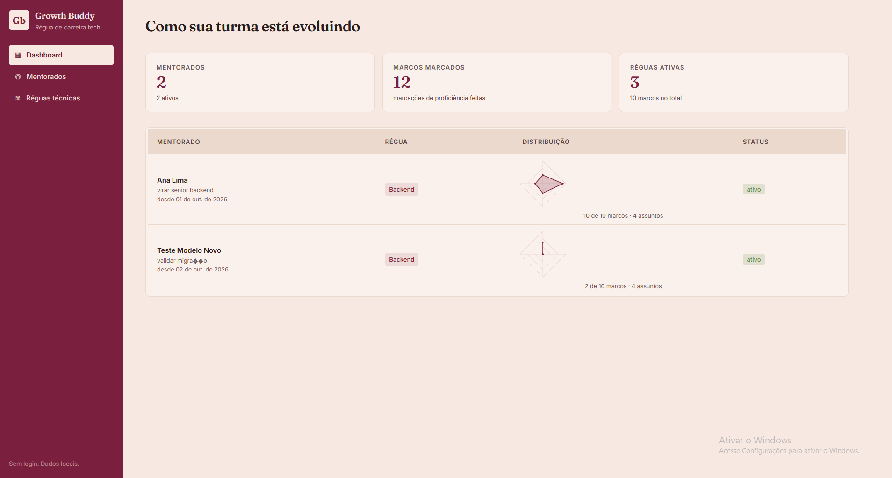
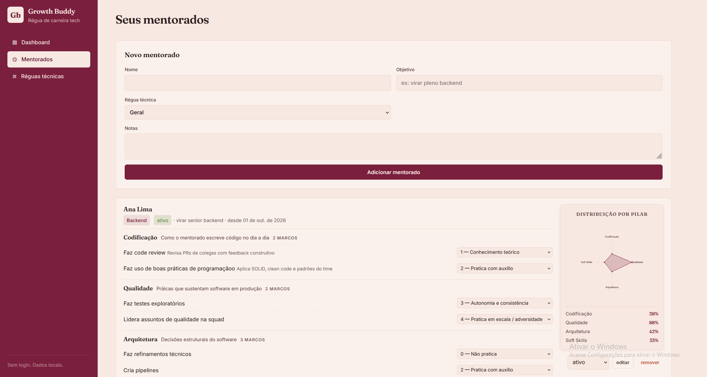
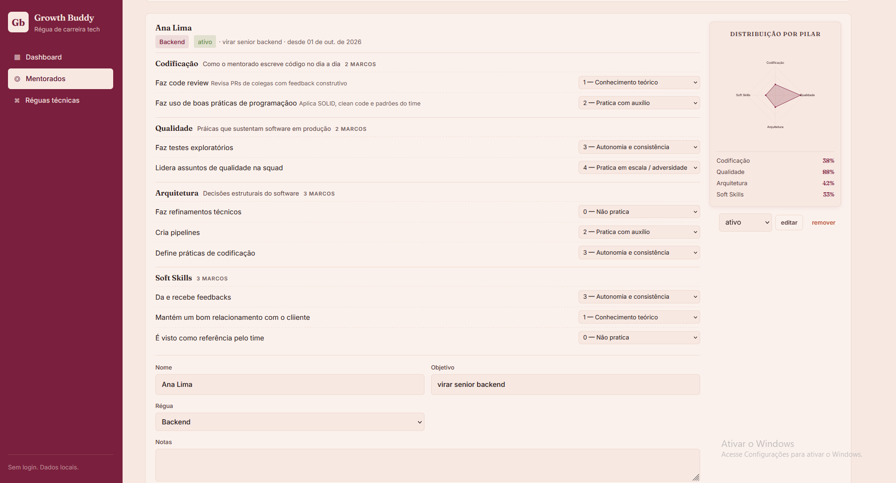
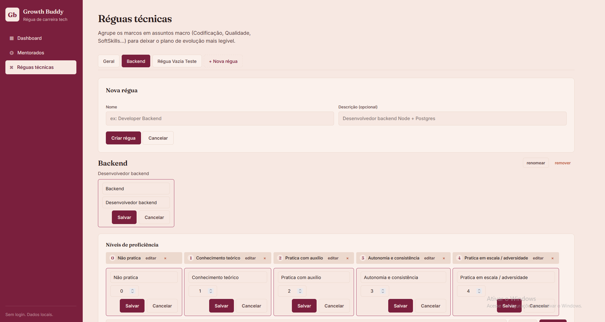
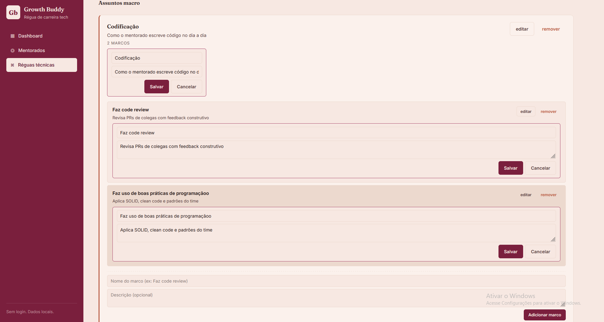

# Growth Buddy

Régua de carreira tech para acompanhar a evolução dos seus mentorados.

App leve, sem login, com dados em arquivo JSON local. Cada trilha técnica tem
seus próprios níveis, marcos e níveis de proficiência, e o mentorado pode ser
marcado item a item conforme progride.

## Screenshots

**Dashboard** — visão geral da turma


**Mentorados** — marcação item a item por pilar de proficiência



**Réguas técnicas** — CRUD de níveis, marcos e assuntos macro



## Features

- **Réguas técnicas por objetivo** (Backend, Frontend, QA, PO, etc.) — crie quantas quiser.
- **Níveis de proficiência** por régua: 4 estágios (teórico, com auxílio, autonomia e consistência, em escala / adversidade) customizáveis por régua.
- **Marcos por nível** (ex.: trainee, júnior, pleno, sênior, especialista I/II) e descrição opcional em cada um.
- **Mentorados** escolhem uma régua para seguir.
- **Progresso granular** por nível: o mentorado indica em qual coluna de proficiência está em cada marco.
- **Dashboard** com progresso por mentorado no nível atual.

## Stack

- **Node.js** (ESM) + **Express 4**
- **lowdb** como banco de dados (JSON em arquivo)
- **nanoid** para IDs
- Frontend: HTML + CSS + JS puro, sem framework

## Como rodar

```bash
npm install
npm start
```

Abre em <http://localhost:3000>.

`db.json` é criado automaticamente na primeira vez que o app roda, com a régua
"Geral" de seed. Migração automática do formato de banco anterior à la
v2/v3 preserva dados existentes.

## Estrutura

- `server.js` — API REST + servidor estático
- `public/index.html`, `app.js`, `style.css` — UI
- `db.json` — dados locais (ignorado no git)

## API (resumo)

### Réguas
- `GET/POST/PUT/DELETE /api/reguas[/:id]`
- `POST/PUT/DELETE /api/reguas/:id/proficiencias[/:profId]`
- `POST/PUT/DELETE /api/reguas/:id/niveis[/:nivelId]`
- `POST/PUT/DELETE /api/reguas/:id/niveis/:nivelId/itens[/:itemId]`

### Mentorados
- `GET/POST/PUT/DELETE /api/mentorados[/:id]`

## Licença

MIT